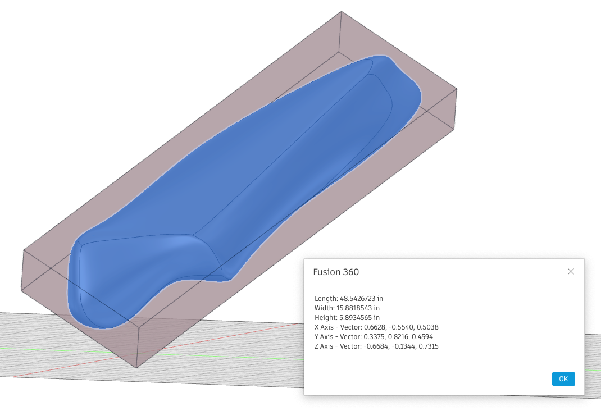

# Fusion 360 Project Data Importer
Script to compute a minimum fit Bounding Box

----



----

## Description

This scripts takes a user selected body and computes a minimum oriented bounding box.

It works by creating a bounding box that is oriented to the body's principal axis of inertia.

As bonus extras it will also generate a custom graphics object and/or a body in the design.

Set the following options at the top of the python script to enable or disable them:
```python
# If set True a custom Graphics Body will be displayed
CREATE_CUSTOM_GRAPHICS = True

# If set True a solid Body will be created
CREATE_BREP_BODY = False
```

## License
Copyright 2022 by Patrick Rainsberry

AUTODESK PROVIDES THIS PROGRAM "AS IS" AND WITH ALL FAULTS. AUTODESK SPECIFICALLY
DISCLAIMS ANY IMPLIED WARRANTY OF MERCHANTABILITY OR FITNESS FOR A PARTICULAR USE.
AUTODESK, INC. DOES NOT WARRANT THAT THE OPERATION OF THE PROGRAM WILL BE
UNINTERRUPTED OR ERROR FREE.
